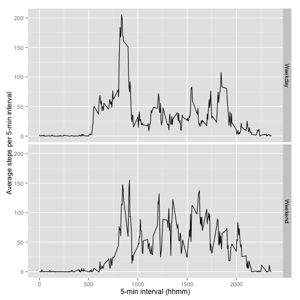

# Reproducible Research: Peer Assessment 1

## Loading and preprocessing the data
Let's start by loading the data, converting the dates to `Date` data type, and adding a weekday column.


```r
activity<-read.csv('activity.csv')
activity$date<-as.Date(activity$date)
activity$weekday<-weekdays(activity$date)
```

## What is mean total number of steps taken per day?

This histogram shows the total number of steps per day. With mean and median values plotted as blue and red lines, respectively.


```r
StepsPerDay<-tapply(activity$steps, activity$date, sum)
hist(StepsPerDay, main = 'Histogram of steps per day', xlab = 'Steps per day')
MeanStepsPerDay<-mean(StepsPerDay, na.rm=TRUE)
MedianStepsPerDay<-median(StepsPerDay, na.rm=TRUE)
abline(v=MeanStepsPerDay, col="blue")
abline(v=MedianStepsPerDay, col="red")
```

 

The lines are very close to each other and hardly distinguishable on the plot. The mean is 10766 and the median is 10765.

## What is the average daily activity pattern?


```r
StepsPerInterval=
  aggregate(activity$steps, by=list(activity$interval), FUN=mean, na.rm=TRUE)
plot(StepsPerInterval$Group.1,
     StepsPerInterval$x, type="l", 
     main="Average number of steps per 5-min interval", 
     xlab="5-min interval (hhmm)", 
     ylab="Average steps per 5-min interval")
```

 

On average across the observed period, the highest number of steps was during interval:  


```r
StepsPerInterval[which.max(StepsPerInterval$x),1]
```

```
## [1] 835
```
This corresponds to 206.1698 steps per 5 minutes on average across the 2-month period.

## Imputing missing values
Note that there are **missing values** for numbers of steps for some combinations of date and interval. Total count of such occurences in the dateset:

```r
nrow(subset(activity,is.na(activity$steps)))
```

```
## [1] 2304
```

Let's impute the missing values of the `steps` variable using simple substitution by the median of the variable for the same interval in other days. Summary of the imputed dataset follows.


```r
intmedians<-as.matrix(tapply(activity$steps, activity$interval, median, na.rm=TRUE))
forimp<-subset(activity,is.na(activity$steps))
imputed<-merge(forimp, intmedians, by.x=3, by.y=0, all.x=TRUE)
colnames(imputed)<-c('interval', 'NA', 'date', 'weekday', 'steps')
activity.imputed<-rbind(subset(activity,is.na(activity$steps)==FALSE), imputed[,c(5,3,1,4)])
summary(activity.imputed)
```

```
##      steps          date               interval      weekday         
##  Min.   :  0   Min.   :2012-10-01   Min.   :   0   Length:17568      
##  1st Qu.:  0   1st Qu.:2012-10-16   1st Qu.: 589   Class :character  
##  Median :  0   Median :2012-10-31   Median :1178   Mode  :character  
##  Mean   : 33   Mean   :2012-10-31   Mean   :1178                     
##  3rd Qu.:  8   3rd Qu.:2012-11-15   3rd Qu.:1766                     
##  Max.   :806   Max.   :2012-11-30   Max.   :2355
```


Now that we have imputed the missing values, let's rebuild the histogram of the total number of steps per day:


```r
StepsPerDay<-tapply(activity.imputed$steps, activity.imputed$date, sum)
hist(StepsPerDay, main = 'Histogram of steps per day based on imputed data', xlab = 'Steps per day')
MeanStepsPerDay<-mean(StepsPerDay, na.rm=TRUE)
MedianStepsPerDay<-median(StepsPerDay, na.rm=TRUE)
abline(v=MeanStepsPerDay, col="blue")
abline(v=MedianStepsPerDay, col="red")
```

 

The mean has now decreased significantly due to the imputation method based on median. The mean is now 9503.9 and the median is 10395.

## Are there differences in activity patterns between weekdays and weekends?
Let's map the data to *Weekday* or *Weekend*. 

```r
DaysOfWeek <- as.data.frame(
  cbind(
    c("Monday","Tuesday","Wednesday","Thursday","Friday","Saturday","Sunday"),
    c("Weekday","Weekday","Weekday","Weekday","Weekday","Weekend","Weekend")))

activity.imputed.weekend<-merge(activity.imputed,DaysOfWeek,by.x=4,by.y=1)
colnames(activity.imputed.weekend)[5]<-"TypeOfDay"
```

Aggregation for plotting:

```r
StepsPerInterval=
  aggregate(activity.imputed.weekend$steps,
            by=c(list(activity.imputed.weekend$interval),
                 list(activity.imputed.weekend$TypeOfDay)),
            FUN=mean, na.rm=TRUE)
colnames(StepsPerInterval)<-c('Interval','TypeOfDay','Steps')
```

And the plot itself, split by Weekday/Weekend:

```r
library(ggplot2)
p<-ggplot(StepsPerInterval, aes(x=Interval, y=Steps)) +
    geom_line() +
    xlab("5-min interval (hhmm)")+
    ylab("Average steps per 5-min interval")+
    facet_grid(TypeOfDay~.)
p
```

 

We can see a more balanced activity over the course of the day during weekend, with a less pronounced peak in the morning and higher walking activity in the afternoon.
